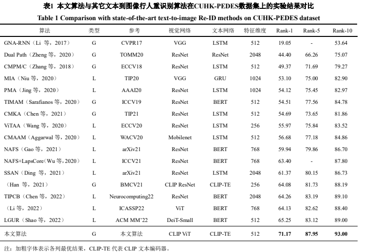
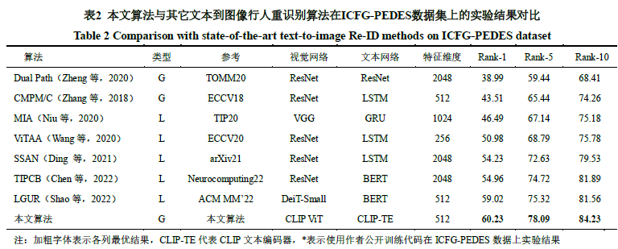

# [JIG2022] Temperature-scaled Projection Matching with CLIP for Text-to-Image Person Re-identification [pdf](http://www.cjig.cn/jig/ch/reader/view_abstract.aspx?flag=2&file_no=202206090000003&journal_id=jig)

The official repository for 温度投影匹配结合CLIP的文本到图像行人重识别(Temperature-scaled Projection Matching with CLIP for Text-to-Image Person Re-identification) achieves state-of-the-art performances on text-to-image person ReID.


## Installation
### Requirements
we use single RTX3090 24G GPU for training and evaluation. 
```
pytorch 1.9.0
torchvision 0.10.0
prettytable
easydict
```

### Prepare Datasets
Request the CUHK-PEDES dataset from [lishuang](https://github.com/ShuangLI59/Person-Search-with-Natural-Language-Description) and ICFG-PEDES dataset from [Zefeng Ding](https://github.com/zifyloo/SSAN)

Organize them in `data` folder as follows:
```
|-- data/
|   |-- <CUHK-PEDES>/
|       |-- imgs
            |-- cam_a
            |-- cam_b
            |-- ...
|       |-- reid_raw.json
|
|   |-- <ICFG-PEDES>/
|       |-- imgs
            |-- test
            |-- train 
|       |-- ICFG_PEDES.json
```

### Prepare CLIP Pre-trained Models
You need to download the CLIP pretrained [ViT-B/16 model](https://openaipublic.azureedge.net/clip/models/5806e77cd80f8b59890b7e101eabd078d9fb84e6937f9e85e4ecb61988df416f/ViT-B-16.pt) from [openai](https://github.com/openai/CLIP) and put it in `data` folder.

### Train
run `experiments/CUHK-PEDES/run.sh` or run python command below:
```python
python train.py \
--img_aug \
--batch_size 128 \
--dataset_name 'CUHK-PEDES' \
--tcmpm 'on'
```

### Test

```python
python test.py --config_file 'experiments/CUHK-PEDES/outputs/CLIP2TextReID/logs/configs.yaml'
```

## Results
### Performance comparisons with state-of-the-art methods on CUHK-PEDES dataset.


### Performance comparisons with state-of-the-art methods on ICFG-PEDES dataset.


## Citation
If you find this code useful for your research, please cite our paper
```
Jiang D, Ye M. 2022. Temperature-scaled Projection Matching with CLIP for Text-to-Image Person Re-identification. Journal of Image and Graphics. (姜定, 叶茫. 2022. 温度投影匹配结合CLIP的文本到图像行人重识别. 中国图象图形学报.) [DOI: 10.11834/jig.220620]

@article{jiang_2022,
	doi = {10.11834/jig.220620},
	url = {https://doi.org/10.11834/jig.220620},
	year = 2022,
	number = {11},
	author = {Jiang Ding and Ye Mang},
	title = {Temperature-scaled Projection Matching with CLIP for Text-to-Image Person Re-identification},
	journal = {JOURNAL OF IMAGE AND GRAPHICS}
}
```

## Contact
If you have any question, please feel free to contact us. E-mail: jiangding@whu.edu.cn , yemang@whu.edu.cn
